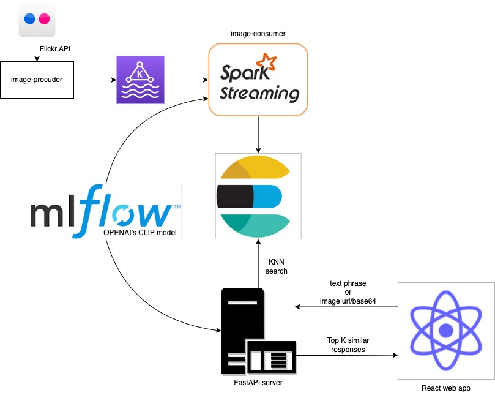

# Image-Search-Engine

This repo contains an end-to-end implementation of an image search engine application.
It is a rough simulation of a real world implementation and contains various modules, which are as follows

1. [image-producer](image-producer/README.md)
2. [image-consumer](image-consumer/README.md)
3. [FastAPI server](server/README.md)
4. [React web app](client/README.md)

### Architecture diagram

Images from Flickr are extracted using an API key and the
[search API](https://www.flickr.com/services/api/flickr.photos.search.html) provided by the Flickr team.
These images along with some additional metadata (also extracted from Flickr) are converted to producer records
and pushed to Kafka.

These records are then processed by a spark streaming application (at a 1-min interval) to extract the embeddings
of the images. This embedding alongside the metadata are then written into elasticsearch.
ElasticSearch provides vector KNN search capabilities, along with pagination and regular text based search.

Kafka allows for decoupling of the image data extraction from Flickr and the spark processing, this
allows for handling Flickr APIs' ratelimiting and spark's resource related issues.
This allows us to limit our spark cluster to be in a cost-efficient size.

The CLIP model's artifact files are managed using mlflow, this allows for better versioning of the models and enables
model registry capabilities. Allowing for efficient model usage, versioning and
management, across the consumer and server applications.

The backend server is a lightweight FastAPI based server, which exposes 2 endpoints to its clients.

1. /text_search - takes a text phrase
2. /image_search - takes an image url or base64 image string

and returns the top K matching responses stored in elasticsearch. These are then displayed in
the KNN score order on the frontend.

### Demo

Below is an example of the results when searching with phrase `playing dogs`.

[OpenAI's CLIP model](https://openai.com/research/clip) has been trained on multiple languages and
hence it has the capability to infer text from various languages. Below is an example
when using the german translated phrase for `playing dogs` which is `spielende Hunde`.

As you can see the results are very similar to when an english phrase was used.
This demonstrates the multilingual capability of CLIP model.

The results as a whole display the capability of the model to carry out cross domain tasks across text and images.

### Tech stack used

1. [Confluent Kafka](https://www.confluent.io/lp/apache-kafka)
2. [ElasticSearch](https://www.elastic.co/elasticsearch/)
3. [Pyspark streaming](https://spark.apache.org/docs/latest/streaming-programming-guide.html)
4. [FastAPI](https://fastapi.tiangolo.com/lo/)
5. [HuggingFace transformers](https://huggingface.co/)
6. [Reactjs](https://react.dev/)

